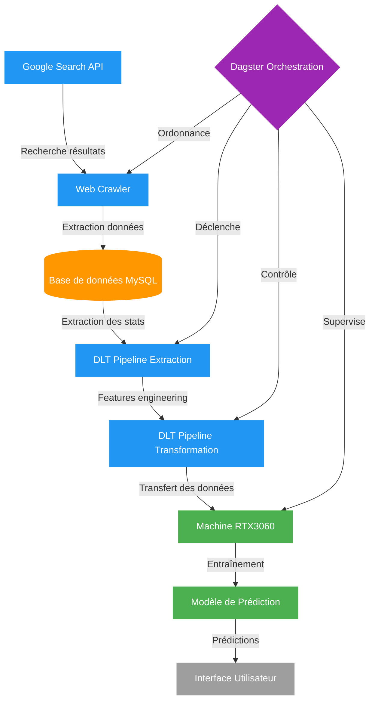

# Football Predictor

Système modulaire de prédiction des résultats de football avec crawling de données, stockage MySQL et entraînement de modèles ML.

## Architecture du système



## Structure du projet

```
football_predictor/
├── __init__.py
├── dagster/                       # Orchestration avec Dagster
│   ├── __init__.py
│   ├── definitions.py             # Définition du repo Dagster
│   ├── assets/                    # Assets de données
│   │   ├── __init__.py
│   │   ├── base_assets.py         # Assets génériques
│   │   └── leagues/               # Assets spécifiques par ligue
│   │       ├── __init__.py
│   │       └── swiss_league.py
│   ├── resources/                 # Configuration des ressources
│   │   ├── __init__.py
│   │   └── database.py
│   └── sensors/                   # Scheduling et déclencheurs
│       ├── __init__.py
│       └── schedule.py
├── dlt_pipelines/                 # Pipelines DLT pour transfert de données
│   ├── __init__.py
│   ├── sources/                   # Sources de données pour DLT
│   │   ├── __init__.py
│   │   ├── mysql_source.py        # Extraction depuis MySQL
│   │   └── leagues/
│   │       ├── __init__.py
│   │       └── swiss_league.py    # Sources spécifiques pour la ligue suisse
│   ├── destinations/              # Destinations pour DLT
│   │   ├── __init__.py
│   │   └── ml_destination.py      # Configuration pour la machine ML
│   └── transformers/              # Transformations DLT
│       ├── __init__.py
│       └── feature_engineering.py # Préparation des features
├── core/                          # Fonctionnalités de base
│   ├── __init__.py
│   ├── crawler/                   # Modules de crawling
│   │   ├── __init__.py
│   │   ├── base_extractor.py
│   │   └── google_search.py
│   ├── db/                        # Gestion de la base de données
│   │   ├── __init__.py
│   │   ├── connector.py
│   │   ├── migrations/
│   │   │   └── __init__.py
│   │   └── models.py
│   └── ml/                        # Modules de machine learning
│       ├── __init__.py
│       ├── features/
│       │   └── __init__.py
│       ├── models/
│       │   └── __init__.py
│       ├── predict.py
│       └── train.py
├── leagues/                       # Modules spécifiques par ligue
│   ├── __init__.py
│   ├── base.py
│   ├── premier_league/
│   │   └── __init__.py
│   └── swiss_league/
│       ├── __init__.py
│       ├── extractors.py
│       ├── features.py
│       └── transformers.py
├── .env                           # Variables d'environnement
├── .dlt/                          # Configuration DLT
│   └── secrets.toml               # Secrets DLT
├── requirements.txt               # Dépendances Python
└── scripts/                       # Scripts utilitaires
    └── setup_db.py
```

## Flux de travail

1. **Extraction des données**:
   - Le crawler utilise Google Search API pour trouver les sources de résultats de football
   - Les données sont extraites et stockées dans MySQL

2. **Transformation et préparation**:
   - DLT extrait les données de MySQL
   - DLT applique les transformations pour la préparation des features
   - Les données transformées sont envoyées à la machine ML

3. **Entraînement et prédiction**:
   - Le modèle est entraîné sur la machine équipée d'une RTX3060
   - Les prédictions sont générées pour les matchs à venir

4. **Orchestration**:
   - Dagster coordonne l'ensemble du processus
   - Les sensors déclenchent les pipelines à intervalles réguliers

## Fonctions à implémenter par module

### Dagster

#### assets/base_assets.py
- `teams()` - Asset pour les équipes
- `leagues()` - Asset pour les ligues

#### assets/leagues/swiss_league.py
- `swiss_league_data_extraction()` - Extraction des données
- `swiss_league_ml_training()` - Entraînement du modèle ML

#### resources/database.py
- `mysql_resource()` - Ressource pour la connexion MySQL

#### sensors/schedule.py
- `daily_update_sensor()` - Déclencheur quotidien

### DLT

#### sources/mysql_source.py
- `mysql_football_source()` - Source pour MySQL
- `teams()` - Extraction des équipes
- `matches()` - Extraction des matchs
- `match_stats()` - Extraction des statistiques

#### sources/leagues/swiss_league.py
- `swiss_league_source()` - Source spécifique Swiss League
- `swiss_teams()` - Extraction des équipes suisses
- `swiss_matches()` - Extraction des matchs suisses

#### destinations/ml_destination.py
- `get_ml_destination_config()` - Configuration pour la machine ML

#### transformers/feature_engineering.py
- `prepare_match_features()` - Préparation des features de matchs
- `normalize_stats()` - Normalisation des statistiques

### Core

#### crawler/google_search.py
- `search_football_results()` - Recherche via Google API

#### db/connector.py
- `connect_to_db()` - Connexion à MySQL
- `create_tables()` - Création du schéma
- `save_matches()` - Sauvegarde des matchs
- `save_stats()` - Sauvegarde des statistiques

#### ml/train.py
- `train_model()` - Entraînement du modèle
- `evaluate_model()` - Évaluation des performances
- `save_model()` - Sauvegarde du modèle

#### ml/predict.py
- `predict_results()` - Prédiction des résultats futurs

### Leagues / Swiss League

#### swiss_league/extractors.py
- `find_swiss_league_sources()` - Recherche des sources
- `extract_swiss_match_data()` - Extraction des données de matchs

#### swiss_league/features.py
- `create_swiss_features()` - Features spécifiques à la ligue

## Installation et configuration

### Prérequis
- Python 3.9+
- MySQL
- Serveur pour héberger la base de données
- Machine avec RTX3060 pour l'entraînement ML

### Installation

1. Cloner le dépôt
```bash
git clone <url_du_repo>
cd football_predictor
```

2. Exécuter le script de configuration pour créer la structure
```bash
bash setup_project.sh
```

3. Créer un environnement virtuel
```bash
python -m venv venv
source venv/bin/activate  # Linux/Mac
venv\Scripts\activate     # Windows
```

4. Installer les dépendances
```bash
pip install -r requirements.txt
```

5. Configurer les variables d'environnement dans `.env`

6. Configurer les secrets DLT dans `.dlt/secrets.toml`

### Exécution

#### Démarrer Dagster
```bash
dagster dev
```

#### Exécuter manuellement un asset
```bash
dagster asset materialize swiss_league_data_extraction
```

## Extension à d'autres ligues

Pour ajouter une nouvelle ligue:

1. Créer un nouveau module dans `leagues/`
2. Ajouter une source DLT dans `dlt_pipelines/sources/leagues/`
3. Définir les assets Dagster dans `dagster/assets/leagues/`
4. Implémenter les extracteurs et features spécifiques

## Avantages de cette architecture

- **Modularité**: Facilité d'ajout de nouvelles ligues
- **Séparation des préoccupations**: 
  - Dagster gère l'orchestration
  - DLT gère le transfert de données
  - Chaque ligue est un module indépendant
- **Performance**: 
  - Extraction parallèle avec DLT
  - ML sur matériel dédié (RTX3060)
- **Évolutivité**: 
  - Passage facile à d'autres destinations (cloud, etc.)
  - Ajout de nouvelles sources de données
